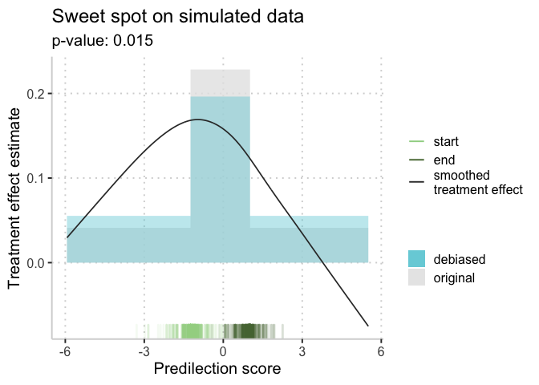
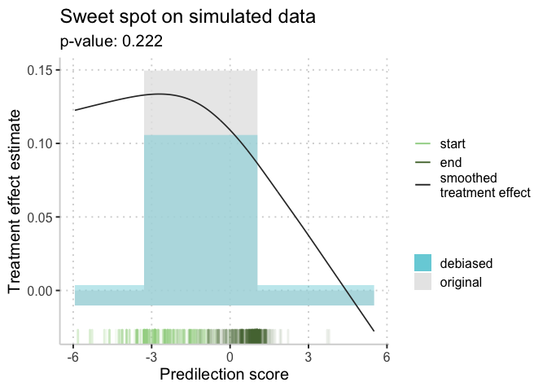

<!-- README.md is generated from README.Rmd. Please edit that file -->

# Sweet spot analysis

## Find and assess treatment effect sweet spots in clinical trial data

Identifying heterogeneous treatment effects (HTEs) in randomized
controlled trials is an important step toward understanding and acting
on trial results. The method in this package exploits any existing
relationship between illness severity and treatment effect, and
identifies the “sweet spot”: the contiguous range of illness severity
where the estimated treatment benefit is maximized. We further compute a
p-value to compare to the null hypothesis of no treatment effect
heterogeneity, and we bias-correct our estimate of the conditional
average treatment effect in the sweet spot. Finally, we provide a
function for visualizing results. Because we identify a single sweet
spot and p-value, we believe our method to be straightforward to
interpret and actionable: results from our method can inform future
clinical trials and help clinicians make personalized treatment
recommendations.

# Example 1: data with a sweet spot

We generate randomized trial data with a treatment effect sweet spot. We
choose n=1000 trial participants with p=10 covariates that - together
with treatment - determine probability of a positive outcome. Treatment
assignment is randomized: every participant has a 50% chance of
receiving treatment.

A participant is in the “sweet spot” if their probability of a positive
outcome (without treatment) is in the middle 20% of probabilities. The
average treatment effect for participants not in the sweet spot is 5%:
that is, treatment additively increases the probability of a positive
outcome by 0.05. For participants in the sweet spot, this is instead
25%.

``` r
set.seed(1234)
n <- 1000; p <- 10;
treated    <- sample(c(0,1), n, replace=TRUE)
covariates <- matrix(rnorm(n * p), nrow=n, ncol=p)
beta       <- rnorm(p)
outcome.prob <- 1/(1+exp(-(covariates %*% beta)))
in.sweet.spot <- !is.na(cut(outcome.prob, c(.4, .6)))
outcome.prob[treated==1 & !in.sweet.spot] <- outcome.prob[treated==1 & !in.sweet.spot] + .05
outcome.prob[treated==1 &  in.sweet.spot] <- outcome.prob[treated==1 & in.sweet.spot]  + .25
outcome.prob     <- pmin(outcome.prob, 1)
positive.outcome <- rbinom(n, 1, prob=outcome.prob)
negative.outcome <- 1-positive.outcome
```

We are now ready to run the sweet spot analysis.

``` r
result <- sweetspot(treated, covariates, negative.outcome, positive.outcome, "binomial")
plot_sweetspot(result, title="Sweet spot on simulated data")
```

<!-- -->

We may also look at the predictions from the prevalidated predilection
score model. For example, we can compute the AU-ROC of the predilection
score model on untreated patients:

``` r
pos.scores <- 1/(1+exp(-result$predilection.scores[negative.outcome==1 & treated==0]))
neg.scores <- 1/(1+exp(-result$predilection.scores[negative.outcome==0 & treated==0]))
auc <- mean(sample(pos.scores,10000,replace=T) > sample(neg.scores,10000,replace=T))
auc
#> [1] 0.827
```

# Example 2: data without a sweet spot

We now generate data without a sweet spot. We again choose n=1000 trial
participants with p=10. The treatment effect for all patients is 5%.

``` r
set.seed(1234)
n <- 1000; p <- 10;
treated    <- sample(c(0,1), n, replace=TRUE)
covariates <- matrix(rnorm(n * p), nrow=n, ncol=p)
beta       <- rnorm(p)
outcome.prob <- 1/(1+exp(-(covariates %*% beta)))
outcome.prob[treated==1] <- outcome.prob[treated==1] + .05
outcome.prob     <- pmin(outcome.prob, 1)
positive.outcome <- rbinom(n, 1, prob=outcome.prob)
negative.outcome <- 1-positive.outcome

result <- sweetspot(treated, covariates, negative.outcome, positive.outcome, "binomial")
plot_sweetspot(result, title="Sweet spot on simulated data")
```

<!-- -->

# References

For details of this method, please see the following preprint:

Erin Craig, Donald A. Redelmeier, and Robert J. Tibshirani. “Finding and
assessing treatment effect sweet spots in clinical trial data.” arXiv
preprint arXiv:2011.10157 (2020). <https://arxiv.org/abs/2011.10157>

For more about the data, please see:

Dondorp, Arjen M., et al. “Artesunate versus quinine in the treatment of
severe falciparum malaria in African children (AQUAMAT): an open-label,
randomised trial.” The Lancet 376.9753 (2010): 1647-1657.
[https://www.sciencedirect.com/science/article/pii/S0140673610619241](The%20Lancet)

The data in this package was downloaded from Github:
<https://github.com/Stije/SevereMalariaAnalysis>.

It was initially published to accompany the following research:

Watson, Leopold et al. Collider bias and the apparent protective effect
of glucose-6-phosphate dehydrogenase deficiency on cerebral malaria
eLife (2019). [https://elifesciences.org/articles/43154](eLife)

Leopold, Watson et al. Investigating causal pathways in severe
falciparum malaria: a pooled retrospective analysis of clinical studies
In Press, PLoS Medicine (2019).
[https://journals.plos.org/plosmedicine/article?id=10.1371/journal.pmed.1002858](PLoS%20Medicine)

Watson, J.A., Holmes, C.C. Graphing and reporting heterogeneous
treatment effects through reference classes. Trials 21, 386 (2020).
[https://doi.org/10.1186/s13063-020-04306-1](Trials)
